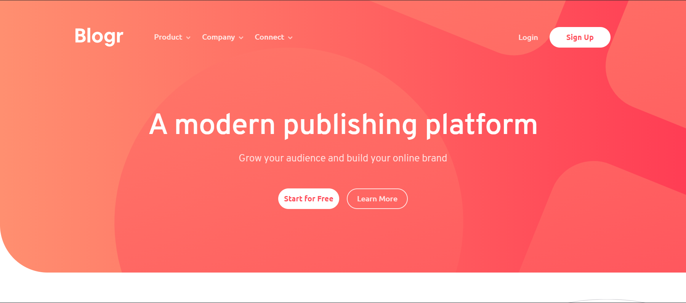

# Frontend Mentor - Blogr landing page

Solución de [Blogr landing page challenge on Frontend Mentor](https://www.frontendmentor.io/challenges/blogr-landing-page-EX2RLAApP).

## Tabla de contenidos

- [Vista general](#vista-general)
  - [Desafío](#desafío)
  - [Screenshot](#screenshot)
  - [Links](#links)
- [Proceso](#proceso)
  - [Construido con](#construido-con)
  - [Recursos útiles](#recursos-útiles)
- [Autores](#autores)

## Vista general

### Desafío

Los usuarios deben:

- Tener una vista óptima para el sitio dependiendo del tamaño de la pantalla del dispositivo del usuario.
- Ver los estados de hover para los elementos interactivos de la página.

### Screenshot

### Links

- Live Site URL: https://paiput-blogr-landing-page.netlify.app/

## Proceso

### Construido con

- Semantic HTML5 markup
- CSS custom properties
- Flexbox
- Desktop-first workflow

### Recursos útiles

- [Fix Horizontal Scroll On Webflow](https://www.youtube.com/watch?v=w2Vcz3rik3E) - Este video nos ayudó a solucionar un problema con el scroll orizontal con css.

## Autores

- Ezequiel Bongiovanni
- Lucas Piputto
- Ramiro Reinaldo
- Gino Somigliana
